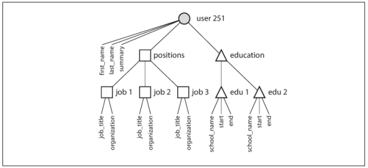

### The 3 concerns that are important in most software systems:

#### *Reliability*
the system should perform correctly even when things go wrong, to further this point:
- the application performs the function that the user expected.
- it can tolerate the user making mistakes or using the software in unexpected ways.
- its performace is good enough for the required use case, under the expected load and data volume.
- the system prevents any unautherized access and abuse.

#### *Scalability*
as the system grows both in data volume, traffic volume, there should be reasonable ways to deal with that growth.

#### *Maintainability*
over time, many different people will work on the system (engineering and operations, both maintaining current behavior and adapting the system to new use cases), and they should all be able to work on it *productively*.


### What to focus on to ease software *Maintainability*

#### *Operability*
make it easy for the operations team to keep the system running smoothly.

#### *Simplicity*
make it easy for new engineers to understand the system, by removing as much complexity as possible from the system.

#### *Evolvability*
make it easy for engineers to make changes to the system in the future, adapting it for unanticipated use cases as requirements change. Also known as *extensibility*, *modifiability*, or *plasticity*.

## Data Models

different applications have different requirements, and the best choice of technology for one use case may well be different from the best chouce for another use case.

#### The Relational Data Model

data is organized into *relations* (called *tables* in SQL), where each relation is an unordered collection of *tuples* (*rows* in SQL).

the uses of this data model appear mundane from today's perspective: typically *transaction processing* (entering sales or banking transactions, airline reservations, stock-keeping in warehouses) and *batch processing* (customer invoicing, payroll, reporting).

#### NoSQL

*Not Only SQL*

there are several driving forces behind the adoption of NoSQL databases, including:

- a need for greater scalability than relational databases can easily achieve, including very large datasets or very high write throughput

- specialized query operations that are not well supported by the relational model

- frustration with the restrictiveness of relational schemas, and a desire for a more dynamic and expressive data model


#### The Object-Relational Mismatch

as most application development today is done in object-oriented programming languages, which leads to a common criticism of the SQL data model: if data is stored in relational tables, an awkward translation layer is required between the objects in the application code and the database model of tables, rows, and column. The disconnect between the models is somtimes called an *impedance mismactch*.

object-relational mapping (ORM) like frameworks reduce the amount of boilerplate code required for this translation layer, but they cant completely hide the differences between the two models.

considering this example:

a resume (a linkedin profile) could be expressed in a relational schema. The profile as a whole can be identified by a unique identifier, `user_id`. Fields like `first_name` and `last_name` appear exactly once per user, so they can be modeled as columns on the `users` table. However, most people have had more than one job in their career (positions), and people may have varying numbers of periods of education and any number of pieces of contact information.
there is a one-to-many relationship from the user to these items, which can be represented in various ways:

- in the SQL model, the most common normalized representation is to put positions, education, and contact information in seperate tables, with foreign key reference to the `users` table.

- in later versions of SQL, support for structured datatypes was added, this allowed multi-valued data to be stored within a single row, with support for querying and indexing inside those documents.

- a third option is to encods jobs, education, and contact info as a JSON or XML document, store it on a text column in the database, and let the application interpret its structure and content. In this setup, you typically cannot use the database to query for values inside that encoded column.

for data structure like a resume, which is mostly a self-contained *document*, a JSON representation can be quite appropriate.
###### JSON representation of a resume:

```
{
    "user_id": 251,
    "first_name": "Bill",
    "last_name": "Gates",
    "summary": "Co-chair of the Bill & Melinda Gates... Active blogger.",
    "region_id": "us:91",
    "industry_id": 131,
    "photo_url": "/p/7/000/253/05b/308dd6e.jpg",
    "positions": [
        {"job_title": "Co-chair", "organization": "Bill & Melinda Gates Foundation"},
        {"job_title": "Co-founder, Chairman", "organization": "Microsoft"}
    ],
    "education": [
        {"school_name": "Harvard University", "start": 1973, "end": 1975},
        {"school_name": "Lakeside School, Seattle", "start": null, "end": null}
    ],
    "contact_info": {
        "blog": "http://thegatesnotes.com",
        "twitter": "http://twitter.com/BillGates"
    }
}
```

the JSON representation has better *locality* than the multi-table schema in the above representation. If you want to fetch a profile in the relational example, you need to either perform multiple queries (query each table by `user_id`) or perform a messy multi-way join between the `users` table and its subordinate tables. In the JSON representation, all the relevant information is in one place, and one query is sufficient.


the one-to-many relationships from the user profile to the user's positions, educational history, and contact information imply a tree structure in the data, and the JSON representation makes this tree structure explicit.



### Many-to-One and Many-to-Many Relationships

in the [above](#json-representation-of-a-resume) section, `region_id` and `industry_id` are given as IDs, not as plain-text strings "`Greater Seattle Area`" and "`Philanthropy`". Why?
if the user interface has free-text fields for entering the region and the industry, it makes sense to store them as plain-text strings. But there are advantages to having standardized lists of geographic regions and industries, and letting users choose from a drop-down list or autocompleter:

